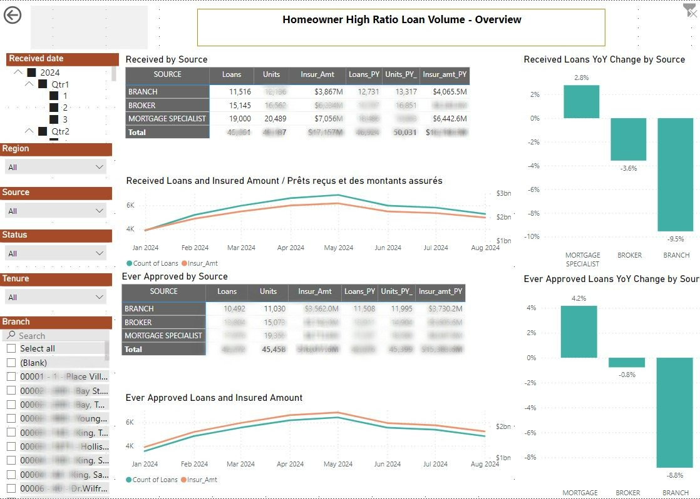
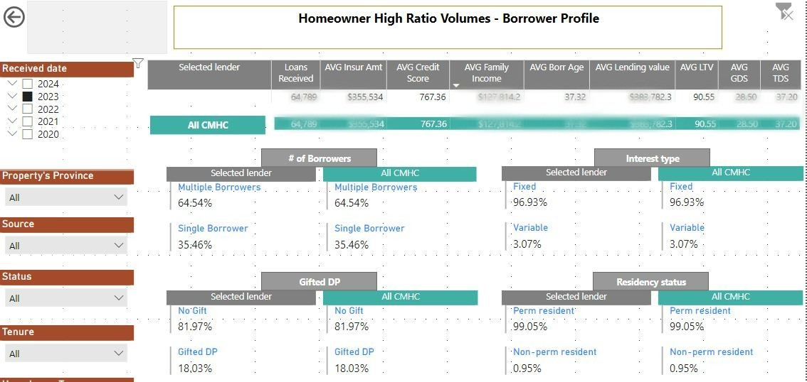
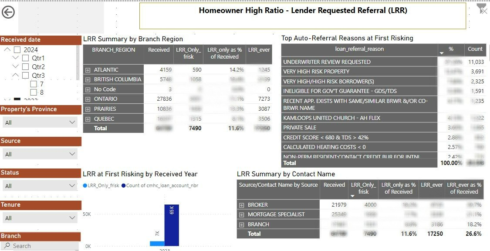

# Self-Service Mortgage Insurance Dashboard

## Project Goal
Provide instrument for the lenders and KAMs to use independently for data insights and reporting

## Project Overview
This Power BI project provides a comprehensive self-service tool for Mortgage Insurance Lenders in Canada, offering key insights into business performance over historic periods. The dashboard organizes and analyzes lender data, including borrower information, product performance, and geographical trends. By answering crucial business questions, the dashboard helps lenders make strategic, data-driven decisions to improve portfolio growth and optimize risk management. This project includes processing and analyzing datasets related to mortgage insurance applications and lender performance.

The dashboard is built on the data creation step described here:

*Disclaimer: The report does not represent any Company, Institution or Country  and uses dummy dataset for demonstration purposes only.*
  
---

## Questions Answered

* What is the total insured amount by province for X lender last quarter and how it compares with overall market?
* Which province is bringing in more clients with higher risk?
* Which sales reps are following rules the least?
* What is our borrower profile on average?

---

## Samples from the dashboard

I used Power Query to clean and transform the data. Other tools used include; slicers, filters and measures. Leveraging visualization tools, I created charts, graphs, and pivot tables to showcase key Performance metrics.

---

**Volumes Overview**

The Volumes page of the dashboard presents historical volume data and year-over-year (YOY) changes, with slicers available to drill down and filter information to the desired level of detail:

**Borrower Profile**

The Borrower page of the dashboard displays data on borrower details and average metric, like Credit score, GDS and TDS:

**Lender Requested Referrals**

The LRR page allows to monitor effectiveness of underwriters and different channels of business:

---

## Conclusion

This Power BI project showcases my ability to create interactive and insightful visualizations, helping lenders manage their mortgage insurance portfolios more effectively. By building this comprehensive dashboard, lenders gained critical insights into borrower behavior, geographic trends, and product performance. The ability to drill down into detailed borrower information and track year-over-year (YOY) changes enabled lenders to identify emerging trends and make proactive business decisions.

## Key insights

- Improved Risk Management: The dashboard revealed that certain regions had higher default rates, prompting lenders to adjust their risk assessment models and focus on more tailored insurance offers.

- Product Optimization: By analyzing product performance over time, lenders identified underperforming products and restructured their offerings to better meet customer needs, boosting their portfolio performance.

- Operational Efficiency: The self-service nature of the dashboard allowed different departments to access the information they needed without waiting for ad-hoc reports, leading to quicker decision-making and more efficient operations.

- Borrower Insights: The ability to track borrower profiles and behaviors across different segments helped lenders fine-tune their marketing strategies and target high-value borrowers more effectively.
